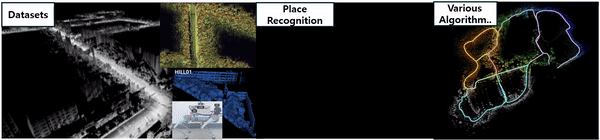

# Awesome-LiDAR-Place-Recognition 

>Thumbnail Figures from Complex Urban, Wild-Places, and DiTer datasets / our place recognition method (TBD) / DiSCo-SLAM.  

This repository is the collection of LiDAR Place Recognition Research that provides a code, together. This repository also reports the datasets for Place Recognition and various algorithms utilized in Place Recognition (e.g. multi-robot mapping, SLAM).

## News!
__`[24.04.01]`__ First commit! 

## LiDAR Place Recognition Methods
- __`2024`__
  -  __`[Handcraft]`__ __`[ICRA]`__ Effectively Detecting Loop Closures using Point Cloud Density Maps [[pdf](https://www.ipb.uni-bonn.de/wp-content/papercite-data/pdf/gupta2024icra.pdf)] [[code](https://github.com/PRBonn/MapClosures)]
  -  __`[Handcraft]`__ __`[❓]`__ BTC: A Binary and Triangle Combined Descriptor for 3D Place Recognition` [under-review] [[code](https://github.com/hku-mars/btc_descriptor)]
  -  __`[Learning]`__ __`[RAL]`__ P-GAT : Pose-Graph Attentional Network for Lidar Place Recognition [[pdf](https://arxiv.org/pdf/2309.00168.pdf)] [[code](https://github.com/csiro-robotics/P-GAT)]

- __`2023`__
  -  __`[Handcraft]`__ __`[TRO]`__ RING++: Roto-Translation-Invariant Gram for Global Localization on a Sparse Scan Map [[pdf](https://ieeexplore.ieee.org/stamp/stamp.jsp?tp=&arnumber=10224330)] [[code](https://github.com/lus6-Jenny/RING)]
  -  __`[Handcraft]`__ __`[ICRA]`__ STD: A Stable Triangle Descriptor for 3D place recognition [[pdf](https://arxiv.org/pdf/2209.12435.pdf)] [[code](https://github.com/hku-mars/STD)]
  -  __`[Learning]`__ __`[ICCV]`__ BEVPlace: Learning LiDAR-based Place Recognition using Bird's Eye View Images [[pdf](https://arxiv.org/pdf/2302.14325.pdf)] [[code](https://github.com/zjuluolun/BEVPlace)]
  -  __`[Learning]`__ __`[IROS]`__ Uncertainty-Aware Lidar Place Recognition in Novel Environments [[pdf](https://arxiv.org/pdf/2210.01361.pdf)] [[code](https://github.com/csiro-robotics/Uncertainty-LPR)]

- __`2022`__
    -  __`[Handcraft]`__ __`[ICARCV]`__ Frequency-Domain Scan Context for Robust LiDAR-based Place Recognition with Translation and Rotation Invariance [[pdf](https://arxiv.org/pdf/2206.12628.pdf)] [[code](https://github.com/soytony/FreSCo)] 🔥
    -  __`[Handcraft]`__ __`[TRO]`__ Scan Context++: Structural Place Recognition Robust to Rotation and Lateral Variations in Urban Environments [[pdf](https://arxiv.org/pdf/2109.13494.pdf)] [[code](https://github.com/gisbi-kim/scancontext_tro)] 🔥
    -  __`[Learning]`__ __`[ICRA]`__ LoGG3D-Net: Locally Guided Global Descriptor Learning for 3D Place Recognition [[pdf](https://arxiv.org/pdf/2109.08336.pdf)] [[code](https://github.com/csiro-robotics/LoGG3D-Net)] 🔥
    -  __`[Learning]`__ __`[RAL/IROS]`__ OverlapTransformer: An Efficient and Yaw-Angle-Invariant Transformer Network for LiDAR-Based Place Recognition [[pdf](https://arxiv.org/pdf/2203.03397.pdf)] [[code](https://github.com/haomo-ai/OverlapTransformer)] 🔥
    -  __`[Learning]`__ __`[CVPR]`__ BVMatch: Lidar-based Place Recognition Using Bird's-eye View Images [[pdf](https://arxiv.org/pdf/2109.00317.pdf)] [[code](https://github.com/zjuluolun/BVMatch)] 🔥
    -  __`[Learning]`__ __`[RAL]`__ RINet: Efficient 3D Lidar-Based Place Recognition Using Rotation Invariant Neural Network [[pdf](https://ieeexplore.ieee.org/stamp/stamp.jsp?tp=&arnumber=9712221)] [[code](https://github.com/lilin-hitcrt/RINet)] 🔥
    -  __`[Learning]`__ __`[TRO]`__ LCDNet: Deep Loop Closure Detection and Point Cloud Registration for LiDAR SLAM [[pdf](https://arxiv.org/pdf/2103.05056.pdf)] [[code](https://github.com/robot-learning-freiburg/LCDNet)] 🔥
    -  __`[Learning]`__ __`[ICPR]`__ Improving Point Cloud Based Place Recognition with Ranking-based Loss and Large Batch Training [[pdf](https://arxiv.org/pdf/2203.00972.pdf)] [[code](https://github.com/jac99/MinkLoc3Dv2)] 🔥
    -  __`[Learning]`__ __`[IROS]`__ InCloud: Incremental Learning for Point Cloud Place Recognition [[pdf](https://arxiv.org/pdf/2203.00807.pdf)] [[code](https://github.com/csiro-robotics/InCloud)] 🔥
    -  __`[Learning]`__ __`[TIE]`__ SeqOT: A Spatial-Temporal Transformer Network for Place Recognition Using Sequential LiDAR Data [[pdf](https://arxiv.org/pdf/2209.07951.pdf)] [[code](https://github.com/BIT-MJY/SeqOT)] 🔥

- __`2021`__
    -  __`[Handcraft]`__ __`[ICRA]`__ Robust Place Recognition using an Imaging Lidar [[pdf](https://arxiv.org/pdf/2103.02111.pdf)] [[code](https://github.com/TixiaoShan/imaging_lidar_place_recognition)] 🔥
    -  __`[Learning]`__ __`[ICRA]`__ Locus: LiDAR-based Place Recognition using Spatiotemporal Higher-Order Pooling [[pdf](https://arxiv.org/pdf/2011.14497.pdf)] [[code](https://github.com/csiro-robotics/locus)] 🔥
    -  __`[Learning]`__ __`[ICRA]`__ NDT-Transformer: Large-Scale 3D Point Cloud Localisation using the Normal Distribution Transform Representation [[pdf](https://arxiv.org/pdf/2103.12292.pdf)] [[code](https://github.com/dachengxiaocheng/NDT-Transformer)] 🔥
    -  __`[Learning]`__ __`[RAL/ICRA]`__ Disco: Differentiable scan context with orientation [[pdf](https://arxiv.org/pdf/2010.10949.pdf)] [[code](https://github.com/MaverickPeter/DiSCO-pytorch)] 🔥
    -  __`[Learning]`__ __`[RAL]`__ EgoNN: Egocentric Neural Network for Point Cloud Based 6DoF Relocalization at the City Scale [[pdf](https://arxiv.org/pdf/2110.12486.pdf)] [[code](https://github.com/jac99/Egonn)] 🔥
    -  __`[Learning]`__ __`[WACV]`__ MinkLoc3D: Point Cloud Based Large-Scale Place Recognition [[pdf](https://arxiv.org/pdf/2011.04530.pdf)] [[code](https://github.com/jac99/MinkLoc3D)] 🔥
    -  __`[Learning]`__ __`[RAL]`__ MinkLoc3D-SI: 3D LiDAR Place Recognition With Sparse Convolutions, Spherical Coordinates, and Intensity [[pdf](https://arxiv.org/pdf/2112.06539.pdf)] [[code](https://github.com/KamilZywanowski/MinkLoc3D-SI)]

- __`2020`__
  -  __`[Handcraft]`__ __`[IROS]`__ LiDAR Iris for Loop-Closure Detection  [[pdf](https://ieeexplore.ieee.org/stamp/stamp.jsp?tp=&arnumber=9341010)] [[code](https://github.com/BigMoWangying/LiDAR-Iris)] 🔥
  -  __`[Handcraft]`__ __`[ICRA]`__ Intensity Scan Context: Coding Intensity and Geometry Relations for Loop Closure Detection [[pdf](https://arxiv.org/pdf/2003.05656.pdf)] [[code](https://github.com/wh200720041/iscloam)] 🔥
  -  __`[Learning]`__ __`[RSS]`__ OverlapNet: Loop Closing for LiDAR-based SLAM  [[pdf](https://arxiv.org/pdf/2105.11344.pdf)] [[code](https://github.com/PRBonn/OverlapNet)] 🔥
  -  __`[Learning]`__ __`[TITS]`__ 3D LiDAR-Based Global Localization Using Siamese Neural Network [[pdf](https://ieeexplore.ieee.org/stamp/stamp.jsp?tp=&arnumber=8734150)] [[code](https://github.com/HuanYin94/LocNet_caffe)] 🔥

- __`2019`__
  -  __`[Learning]`__ __`[CVPR]`__ PCAN: 3D Attention Map Learning Using Contextual Information for Point Cloud Based Retrieval [[pdf](https://arxiv.org/pdf/1904.09793.pdf)] [[code](https://github.com/XLechter/PCAN)] 🔥

- __`2018`__
  -  __`[Handcraft]`__ __`[IROS]`__ Scan Context: Egocentric Spatial Descriptor for Place Recognition Within 3D Point Cloud Map [[pdf](https://ieeexplore.ieee.org/stamp/stamp.jsp?tp=&arnumber=8593953)] [[code](https://github.com/gisbi-kim/scancontext)] 🔥
  -  __`[Learning]`__ __`[CVPR]`__ PointNetVLAD: Deep Point Cloud Based Retrieval for Large-Scale Place Recognition [[pdf](https://arxiv.org/pdf/1804.03492.pdf)] [[code](https://github.com/mikacuy/pointnetvlad)] 🔥

- __`2017`__
  -  __`[Learning]`__ __`[ICRA]`__ SegMatch: Segment based place recognition in 3D point clouds [[pdf](https://arxiv.org/pdf/1609.07720/1000.pdf)] [[code](https://github.com/ZengYeGe/segmatch)] 🔥

- __`2016`__
  -  __`[Handcraft]`__ __`[IROS]`__ M2DP: A novel 3D point cloud descriptor and its application in loop closure detection [[pdf](https://ieeexplore.ieee.org/stamp/stamp.jsp?tp=&arnumber=7759060)] [[code](https://github.com/LiHeUA/M2DP)] 🔥

- __`2015`__
  -  __`[Handcraft]`__ __`[IROS]`__ A Fast Histogram-Based Similarity Measure for Detecting Loop Closures in 3-D LIDAR Data [[pdf](https://ieeexplore.ieee.org/stamp/stamp.jsp?tp=&arnumber=7353454)] [[code](https://github.com/wangliuliu/histogram)] 🔥

## LiDAR Place Recognition Datasets
- __`2024`__
  -  __`[Single/Multi]`__ __`[IJRR]`__ __`[OS2-128]`__ __`[VLP-16]`__ __`[Avia]`__ __`[Aeva]`__ Heterogeneous LiDAR Dataset for inter-LiDAR Place Recognition [[pdf](https://arxiv.org/pdf/2309.14590.pdf)] [[download](https://sites.google.com/view/heliprdataset/home?authuser=0)] 🚙
  -  __`[Single/Multi]`__ __`[IEEE Sensors Letter]`__ __`[OS1-64]`__ __`[OS1-32]`__ DiTer: Diverse Terrain and Multi-Modal Dataset for Field Robot Navigation in Outdoor Environments [[pdf](https://ieeexplore.ieee.org/stamp/stamp.jsp?tp=&arnumber=10416213)] [[download](https://sites.google.com/view/diter-dataset/)] 🚙

- __`2023`__
  -  __`[Single/Multi]`__ __`[ICRA]`__ __`[VLP-16]`__ Wild-Places: A Large-Scale Dataset for Lidar Place Recognition in Unstructured Natural Environments [[pdf](https://arxiv.org/pdf/2211.12732.pdf)] [[download](https://csiro-robotics.github.io/Wild-Places/)] 🧔
  -  __`[Multi]`__ __`[IROS-workshop]`__ __`[Mid-70]`__ ConPR: Ongoing Construction Site Dataset for Place Recognition [[pdf](https://oravus.github.io/vpr-workshop/assets/accepted_papers/1_conpr_ongoing_construction_sit.pdf)] [[download](https://github.com/dongjae0107/ConPR)] 🧔
  -  __`[Multi]`__ __`[RAL]`__ __`[VLP-16]`__ GRACO: A Multimodal Dataset for Ground and Aerial Cooperative Localization and Mapping [[pdf](https://ieeexplore.ieee.org/stamp/stamp.jsp?tp=&arnumber=10008011)] [[download](https://sites.google.com/view/graco-dataset)] 🛩️ 🤖
  -  __`[Multi]`__  __`[IJRR]`__ __`[OS1-64]`__ __`[OS1-32]`__ Pohang Canal Dataset: A Multimodal Maritime Dataset for Autonomous Navigation in Restricted Waters [[pdf](https://arxiv.org/abs/2303.05555)] [[download](https://sites.google.com/view/pohang-canal-dataset)] 🚢
  -  __`[Multi-Robot]`__  __`[Arxiv]`__ __`[VLP-16]`__ S3E: A Large-scale Multimodal Dataset for Collaborative SLAM [[pdf](https://arxiv.org/pdf/2210.13723.pdf)] [[download](https://github.com/PengYu-Team/S3E)] 🤖
  -  __`[Multi-Robot]`__  __`[Arxiv]`__ Resilient and Distributed Multi-Robot Visual SLAM: Datasets, Experiments, and Lessons Learned [[pdf](https://arxiv.org/pdf/2304.04362.pdf)] [[download](https://github.com/MIT-SPARK/Kimera-Multi-Data)] 🤖

- __`2020`__
  -  __`[Single/Multi]`__ __`[ICRA]`__ __`[OS1-64]`__ Multimodal Range Dataset for Urban Place Recognition [[pdf](https://rpm.snu.ac.kr/publications/gskim-2020-icra.pdf)] [[download](https://sites.google.com/view/mulran-pr)] 🚙

- __`2019`__
  -  __`[Single]`__ __`[IJRR]`__ __`[VLP-16]`__ Complex urban dataset with multi-level sensors from highly diverse urban environments [[pdf](https://journals.sagepub.com/doi/pdf/10.1177/0278364919843996)] [[download](https://sites.google.com/view/complex-urban-dataset/system?authuser=0)] 🚙

- __`2013`__
  -  __`[Single]`__ __`[IJRR]`__ __`[HDL-64]`__ Vision meets Robotics: The KITTI Dataset [[pdf](https://journals.sagepub.com/doi/epub/10.1177/0278364913491297)] [[download](https://www.cvlibs.net/datasets/kitti/raw_data.php)] 🚙

## LiDAR Place Recognition Utils
- __`2023`__
  -  __`[Multi-Robot SLAM]`__ __`[IEEE Sensors Journal]`__ DCL-SLAM: A Distributed Collaborative LiDAR SLAM Framework for a Robotic Swarm [[pdf](https://ieeexplore.ieee.org/stamp/stamp.jsp?tp=&arnumber=10375928)] [[code](https://github.com/PengYu-Team/DCL-SLAM)] 🔥

- __`2022`__
  -  __`[Multi-Robot SLAM]`__ __`[RAL]`__ DiSCo-SLAM: Distributed Scan Context-Enabled Multi-Robot LiDAR SLAM With Two-Stage Global-Local Graph Optimization [[pdf](https://ieeexplore.ieee.org/stamp/stamp.jsp?tp=&arnumber=9662965)] [[code](https://github.com/RobustFieldAutonomyLab/DiSCo-SLAM)] 🔥
